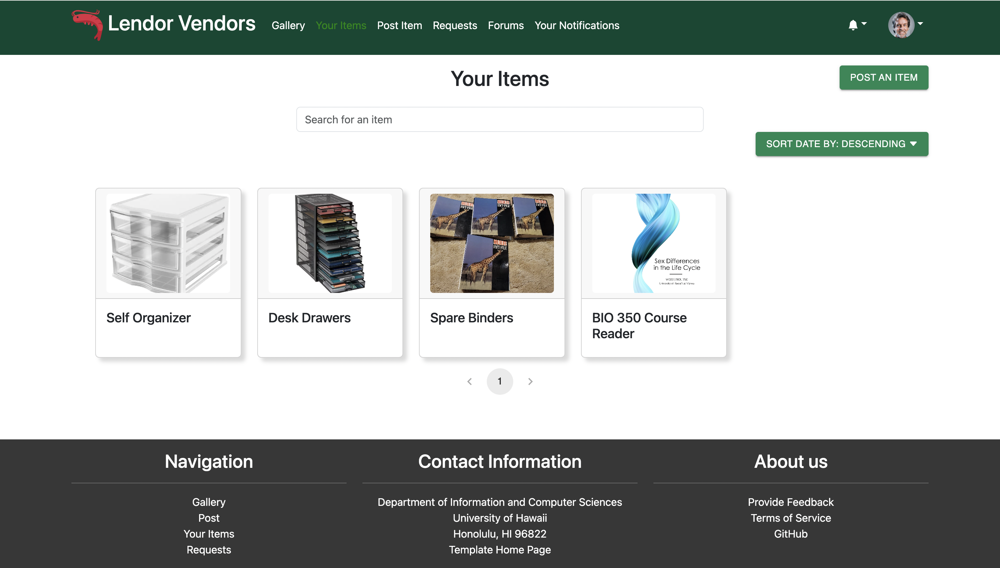
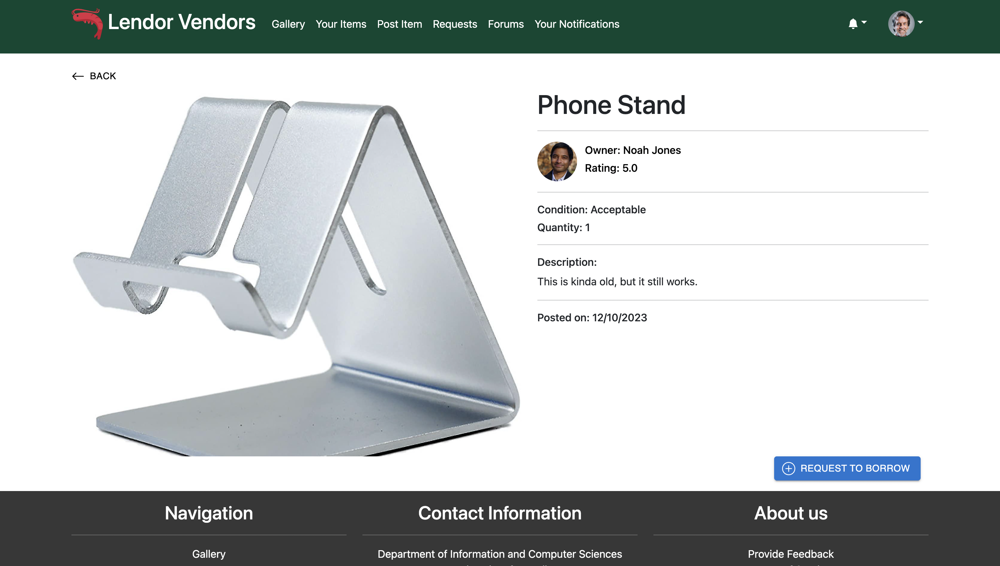

## Overview
Lendor Vendors is a web application that allows users to list and view their own items for loan. Users can also view other users' items and request to borrow them. It features a rating system for both parties to rate each other, promoting user interactions and trust. 
### Team Contract
This is the [contract](https://docs.google.com/document/d/1NaDirEUvLssdwOibyXWChI3mM2_KJonmv6Q50NxB768/edit) that we wrote up to keep each other accountable.
## User Guide
This section provides a walkthrough of the Lendor Vendor's user interface and it's capabilities.
### Landing Page
The landing page is the site presented to users when they visit the top-level URL of the site.


### Register
If you don't already have an account, you can register and sign up for one.


### Log in
If you already have an account, you can sign in.


### Gallery
The gallery page is where users can view all the items that are available for loan.


### Add Item
The add item page is where users can add their own items for loan.


### List Item
The list item page is where users can list their own items they currently have posted for loan.



The user can also click the item name itself to get a better description and view of the item, where they can choose to edit the item, as well as view the requests for that item.


If that item is not owned by the user, you'll see the button to request to loan the item. 


### Edit Item
The edit item page is where users can edit their own items for loan.


### Request Item
The request item page is where users can request to borrow other users' items.



### Fulfill Request
The fulfill request page is where users can fulfill other users' requests to borrow their items.


### Rate Items and Users
Users can rate items that they have borrowed before, to let others know how good it was to use, as well as add comments to the rating.


They can also rate the user who loaned the item out.


### Admin
The admin page is where the admin can view all the items listed up for loan. 


## Community Feedback
If you would like to provide feedback on this project, please fill out [this form](https://lendor-vendors.github.io/). Thank you!
## Developer Guide
This section provides information of interest to Meteor developers wishing to use this code base as a basis for their own development tasks.

### Installation

First, [install Meteor](https://www.meteor.com/install).

Second, visit the [Lendor Vendors application github page](https://github.com/lendor-vendors/lendor-vendors/), and click the "Use this template" button to create your own repository initialized with a copy of this application. Alternatively, you can download the sources as a zip file or make a fork of the repo.  However you do it, download a copy of the repo to your local computer.

Third, cd into the lendor-vendors/app directory and install libraries with:

```
$ meteor npm install
```

Fourth, run the system with:

```
$ meteor npm run start
```

If all goes well, the application will appear at [http://localhost:3000](http://localhost:3000).
## Development History
The development process for Lendor Vendors conformed to Issue Driven Project Management practices. 

The project was broken down into a set of issues and each issue was documented in a GitHub issue.  Issues were assigned to team members and the team members created branches named "issue-xxx" where xxx is the issue number to work on.  When the work was complete, the team members merged that branch into the master branch.

###M1

Our goal for M1 was to implement the core functionalities of some of our main pages that the users will be using. We completed the implementation for the gallery, add items, see your items, edit your items, see your incoming and outgoing requests, and viewing items in more detail pages. For this milestone, we focused mainly on getting the pages to work, making sure all the buttons, links work, as well as making sure everything routed to the correct page. In future milestones, we plan on adding more functionality, as well as styling some of the pages that has already been implemented. 

Our M1 Project Page can be found [here](https://github.com/orgs/lendor-vendors/projects/3/views/1).

###M2

For M2, we plan on styling the landing page, as well as other main pages, creating a logo for our application, and implementing more features to make our application better. These features include a filter/searching feature, so our users can easily search for items they want to loan, and a wish list feature where users can request to have certain items put up for loan. 

Our M2 Project Page can be found [here](https://github.com/orgs/lendor-vendors/projects/6).

## Deployment
This project is deployed at [](http://159.223.203.208/)
## Contact Us
### Developers
* [Jiawen Chen](https://jchen20-1.github.io/)
* [Truman Choy](https://choytr.github.io/)
* [Marcus Prudencio](https://marcusp478.github.io/)
* [Kayla Yanos](https://kaylayanos.github.io/)
