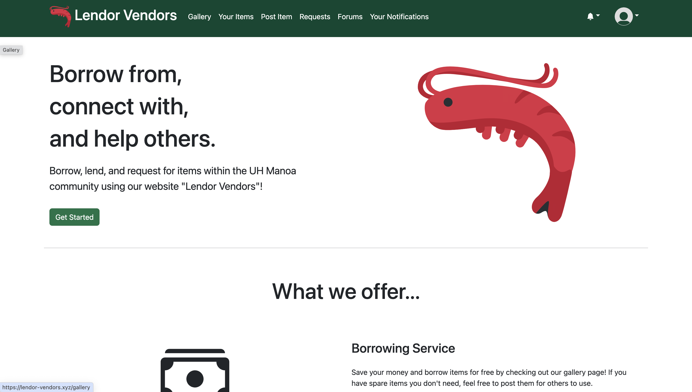
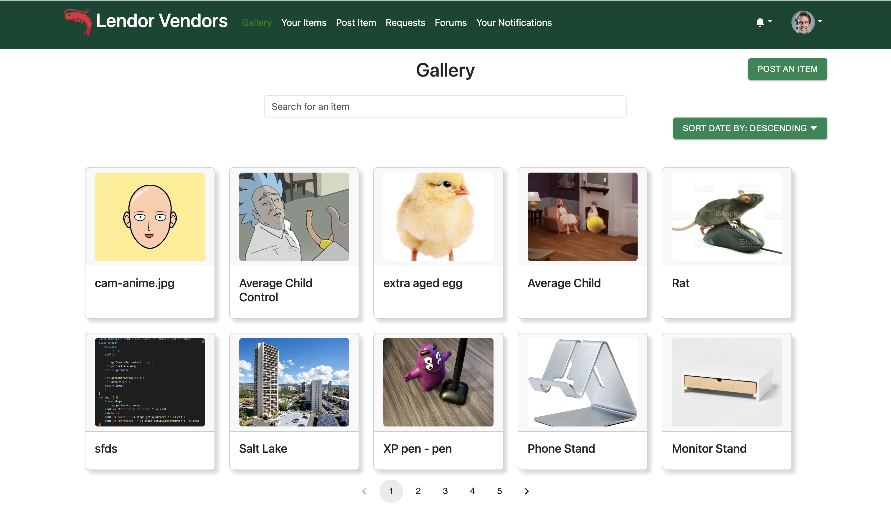
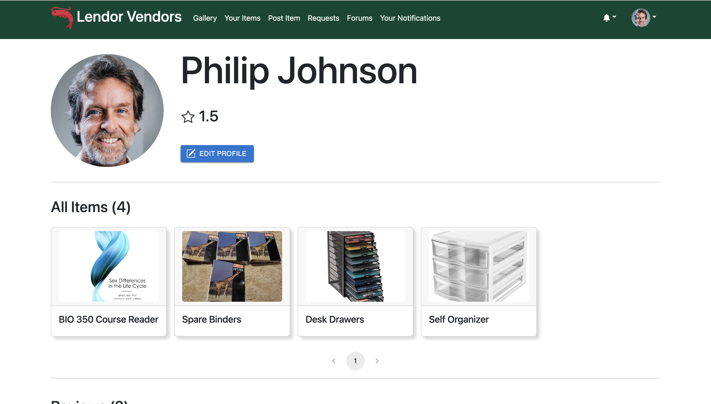

## Overview
Lendor Vendors is a web application that allows users to list and view their own items for loan. Users can also view other users' items and request to borrow them. It features a rating system for both parties to rate each other, promoting user interactions and trust.

## Table of Contents
* [Team Contract](#team-contract)
* [User Guide](#user-guide)
* [Community Feedback](#community-feedback)
* [Developer Guide](#developer-guide)
* [Development History](#development-history)
* [Deployment](#deployment)
* [Contact Us](#contact-us)

### Team Contract
This is the [contract](https://docs.google.com/document/d/1NaDirEUvLssdwOibyXWChI3mM2_KJonmv6Q50NxB768/edit) that we wrote up to keep each other accountable.

## User Guide
This section provides a walkthrough of the Lendor Vendor's user interface and it's capabilities.

### Landing Page
The landing page is the site presented to users when they visit the top-level URL of the site.

<<<<<<< Updated upstream

=======


>>>>>>> Stashed changes

### Register
If you don't already have an account, you can register and sign up for one.


### Log in
If you already have an account, you can sign in.


### Gallery
<<<<<<< Updated upstream
The gallery page is where users can view all the items that are available for loan. Users can also search for an item by its name.



### Your Items
The your items page is where users can list their own items they currently have posted that are available to loan.


The user can also click the item itself to get a better description and view of the item, where they can choose to edit the item, as well as view any requests for that item.


If you click on an item from the gallery that you don't own, you'll see the button to request to loan the item instead. 


### Post Item
The post item page is where users can post their own items for loaning out. Users can describe the item(s) they are posting, give how many are available and their conditions, and provide a url to an image of the items.


=======
The gallery page is where users can view all the items that are available for loan. 


This page has a pagination feature, so users can view 10 items at a time, and choose to see the next set by utilizing either the number pages, or the arrow buttons.


Users can sort the items based on when they were posted, either in ascending or descending order.


### Add Item
The add item page is where users can add their own items for loan.


Users can also choose to post items through the "POST AN ITEM" button located in the gallery and your items pages. 


### Your Items
The your items page is where users can list their own items they currently have posted for loan.


Just like the gallery page, users can also sort the items in ascending or descending order based on when they were posted, as well as navigate through the pages using the number pages or the arrow buttons.


### View Item

The user can also click the item name itself to get a better description and view of the item, where they can choose to edit the item, as well as view the requests for that item, or even delete the item.


When choosing to delete, users will get a pop up confirmation to make sure they want to delete the item.


If that item is not owned by the user, you'll see the button to request to borrow the item. 


>>>>>>> Stashed changes
### Edit Item
Once you click on the "Edit" button, you will be taken to the edit item page. The edit item page is where users can edit their own posted items.


### Request Item
Once you click the "Request To Borrow" button, you will be taken to the request item page. The request item page is where users can request to borrow other users' items.


### Your Notifications

Once a user requests your item, you will receive a notification about it. You can view all your past notifications in the your notifications page.


### Requests Page
The Requests page shows you all the incoming requests you have for your items, as well as any outgoing requests you have made for others' items.


<<<<<<< Updated upstream

### View Requests
The view requests page is where users can accept or deny other users' requests to borrow their item.


### Forums

If you can't find what you're looking for in the gallery, you can make a forum post in hopes that someone has the item you're looking for.


### View Forum Request

You can click on a forum post to view it in full detail. If you have the item the poster is looking for, you can contact them by clicking "Fulfill," which will send a notification to the poster containing your contact information so the item exchange can take place.


If it is your own post, you can delete it or mark it as resolved if you no longer need the item, or if someone has since loaned it to you.


### Post Forum Request

Once you click the "Post a forum request" button from the forums page, you will be taken to the post forum request page. The post forum request page is where you can describe the item you want, give a minimum quantity and condition, and post it.


### View Profile

Users can view the profiles of other users by clicking on their profiles from viewing an item or a forum post.



### Rate Items and Users
Users can rate users that they have borrowed before, to let others know how good it was to use, as well as add comments to the rating.
=======

In the requests for your items tab, multiple people can make requests for the same item, so the user can choose to accept or deny each request individually.


### Forums Page

The forums page is where users can post forums where they're requesting any items they don't see up for loan.
>>>>>>> Stashed changes


All users are allowed to post a forum post, and you can see your own posts by selecting the appropriate tab.


Users can click on the title of the item, and see more information about the post.


After viewing the details, users can choose to fulfill the forum request, and a confirmation popup will show up.


### View Profile
The view profile page is where users can view their own profile, either using the dropdown menu on the top right, or by clicking on their own avatar in their individual item pages. 


In here, they can see their own information, as well as their items they have posted, and any reviews they have received.


You can also see other users' profiles by clicking on their avatar in their individual item pages.


Afterwards, their profile information will show up, where you can leave a review for them.


### Edit Profile
In this page, users can edit their profile information, including editing their name, upload a different image for their avatar, their contact information, as well as their email they use to sign in.


If the user is signing up for the first time, it is highly recommended they go straight to editing their profile, as they start off with a default avatar, and no contact information. Please note that in order to post any items, users need to have a contact information.


### Rate Users 

Users can rate the user who loaned the item out, with a star rating, as well as a comment using this form.


### Notifications

Users can access their notifications in two different ways, through the bell dropdown on the top right of the screen, or through the Your Notifications tab on the navigation bar.


Just like with our gallery and your items page, you can navigate through the different pages of your notifications by using the page number or arrow buttons.


### Admin
<<<<<<< Updated upstream
Admins are able to remove any item posts they deem inappropriate.


They are also to remove any forum posts they deem inappropriate.


=======
When admins are logged in, they see an extra delete button even in items they don't own, so they can properly delete items that violate the terms of service.


>>>>>>> Stashed changes

## Community Feedback
If you would like to provide feedback on this project, please fill out [this form](https://lendor-vendors.github.io/). Thank you!

### Existing User Feedback
These are some feedback we have gotten from various different individuals within the UH community.

M2:

"The UI seems to be very lackluster, especially the landing page, I wish to see more styling for the landing page." - Anonymous

"I wish there was a notifications system where you would get notified when your items get requested, that way its easier to accept or deny them." - Anonymous

M3:

"I wish there was a built in chat system so there would be direct contact with the seller" - Anonymous

"The website is very neat, user friendly, posting and requesting an item is very easy, like how you can add pictures." - Anonymous

"The website was easy to navigate and the shrimp is cute" - Anonymous

"Very easy to post listings with images or gifs" - Anonymous

"For user registration, include contact info as a part of registration" - Anonymous

## Developer Guide
This section provides information of interest to Meteor developers wishing to use this code base as a basis for their own development tasks.

### Installation

First, [install Meteor](https://www.meteor.com/install).

Second, visit the [Lendor Vendors application github page](https://github.com/lendor-vendors/lendor-vendors/), and click the "Use this template" button to create your own repository initialized with a copy of this application. Alternatively, you can download the sources as a zip file or make a fork of the repo.  However you do it, download a copy of the repo to your local computer.

Third, cd into the lendor-vendors/app directory and install libraries with:

```
$ meteor npm install
```

Fourth, run the system with:

```
$ meteor npm run start
```

If all goes well, the application will appear at [http://localhost:3000](http://localhost:3000).
## Development History


The development process for Lendor-Vendors conformed to Continuous Integration and Issue Driven Project Management practices. 

The project was broken down into a set of issues and each issue was documented in a GitHub issue.  Issues were assigned to team members and the team members created branches named "issue-xxx" where xxx is the issue number to work on.  When the work was complete, the team members merged that branch into the master branch.

### M1

Our goal for M1 was to implement the core functionalities of some of our main pages that the users will be using. We completed the implementation for the gallery, add items, see your items, edit your items, see your incoming and outgoing requests, and viewing items in more detail pages. For this milestone, we focused mainly on getting the pages to work, making sure all the buttons, links work, as well as making sure everything routed to the correct page. In future milestones, we plan on adding more functionality, as well as styling some of the pages that has already been implemented. 

Our M1 Project Page can be found [here](https://github.com/orgs/lendor-vendors/projects/3/views/1).

### M2

For M2, we planned on styling the landing page, as well as other main pages, creating a logo for our application, and implementing more features to make our application better. These features include a filter/searching feature, so our users can easily search for items they want to loan, and a wish list feature where users can request to have certain items put up for loan. 

By the end of M2, the overwhelming majority of our efforts ended up being spent pushing out functionality. The requests system, left over from M1, has been finalized in M2, and also the wish list feature evolved into the forums page. We also implemented things you would expect to find in a typical app, like notifications and profile viewing. Though we did make substantial progress reworking much of the styling, most of our efforts were focused on these.

Our M2 Project Page can be found [here](https://github.com/orgs/lendor-vendors/projects/6).

### M3

<<<<<<< Updated upstream
Nearing the end of the finish line, the idea for M3 will be to polish the website as much as possible. We plan to focus on pushing out bug fixes, finishing up leftover functionality updates like implementing review writing, and overhaul a few pages, particularly the landing and request-related pages.

Our M3 Project Page can be found [here](https://github.com/orgs/lendor-vendors/projects/7).

## Deployment
This project is deployed [here](http://lendor-vendors.xyz/).
=======
For M3, we plan on completely revamping most of the pages we have with better styling and quality of life functionalities. We plan to implement some sort of pagination feature for our pages that can display a lot of items/data, to better allow our users to easily navigate through them. We also want to implement a back button on certain pages that are routed after clicking on certain elements on existing pages, so our users can have an easier time going back and forth between pages. We also want to incorporate a forums page, where users can post requests for items they don't see up for loan, and other users can help fulfill them. Finally, we want to add a notifications system, so our users are better notified when their items are requested, if their requests got accepted or denied, as well as if someone helped fulfill their forum posts. 

Our M3 Project page can be found [here](https://github.com/orgs/lendor-vendors/projects/7)

## Deployment
This project is deployed [here](http://lendor-vendors.xyz).
>>>>>>> Stashed changes
## Contact Us
### Developers
* [Jiawen Chen](https://jchen20-1.github.io/)
* [Truman Choy](https://choytr.github.io/)
* [Marcus Prudencio](https://marcusp478.github.io/)
* [Kayla Yanos](https://kaylayanos.github.io/)
