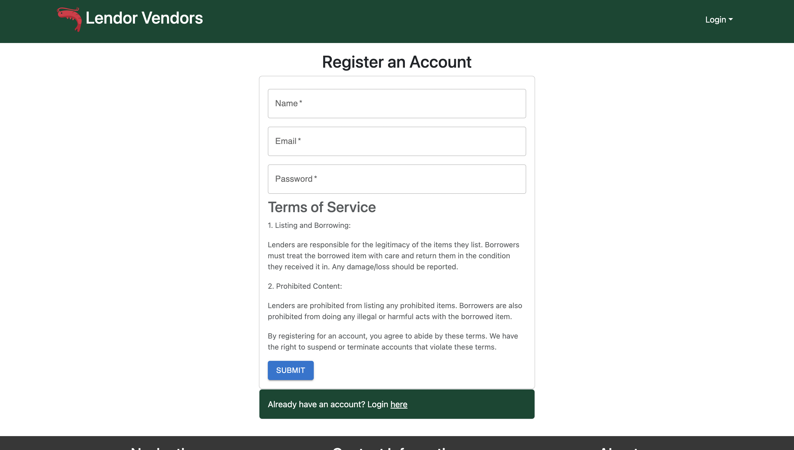
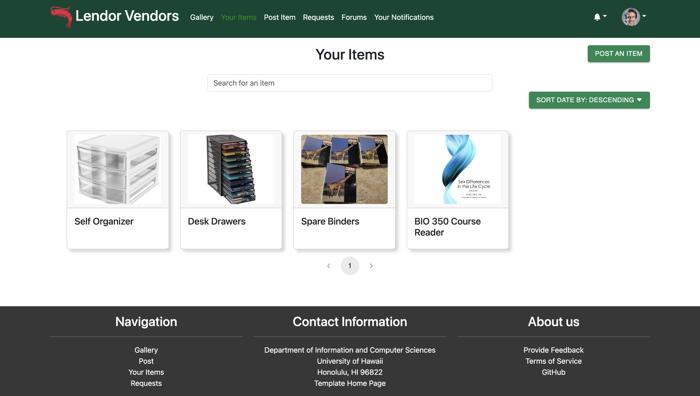

## Overview
Lendor Vendors is a web application that allows users to list and view their own items for loan. Users can also view other users' items and request to borrow them. It features a rating system for both parties to rate each other, promoting user interactions and trust.

## Table of Contents
* [Team Contract](#team-contract)
* [User Guide](#user-guide)
* [Community Feedback](#community-feedback)
* [Developer Guide](#developer-guide)
* [Development History](#development-history)
* [Deployment](#deployment)
* [Contact Us](#contact-us)

### Team Contract
This is the [contract](https://docs.google.com/document/d/1NaDirEUvLssdwOibyXWChI3mM2_KJonmv6Q50NxB768/edit) that we wrote up to keep each other accountable.

## User Guide
This section provides a walkthrough of the Lendor Vendor's user interface and it's capabilities.

### Landing Page
The landing page is the site presented to users when they visit the top-level URL of the site.


### Register
If you don't already have an account, you can register and sign up for one.



### Log in
If you already have an account, you can sign in.


### Gallery
The gallery page is where users can view all the items that are available for loan. Users can also search for an item by its name.


### Your Items
The your items page is where users can list their own items they currently have posted that are available to loan.



The user can also click the item itself to get a better description and view of the item, where they can choose to edit the item, as well as view any requests for that item.


If you click on an item from the gallery that you don't own, you'll see the button to request to loan the item instead. 


### Post Item
The post item page is where users can post their own items for loaning out. Users can describe the item(s) they are posting, give how many are available and their conditions, and provide a url to an image of the items.


### Edit Item
Once you click on the "Edit" button, you will be taken to the edit item page. The edit item page is where users can edit their own posted items.


### Request Item
Once you click the "Request To Borrow" button, you will be taken to the request item page. The request item page is where users can request to borrow other users' items.


### Your Notifications

Once a user requests your item, you will receive a notification about it. You can view all your past notifications in the your notifications page.


### Requests Page
The Requests page shows you all the incoming requests you have for your items, as well as any outgoing requests you have made for others' items.


### View Requests
The view requests page is where users can accept or deny other users' requests to borrow their item.


### Forums

If you can't find what you're looking for in the gallery, you can make a forum post in hopes that someone has the item you're looking for.


### View Forum Request

You can click on a forum post to view it in full detail. If you have the item the poster is looking for, you can contact them by clicking "Fulfill," which will send a notification to the poster containing your contact information so the item exchange can take place.


If it is your own post, you can delete it or mark it as resolved if you no longer need the item, or if someone has since loaned it to you.


### Post Forum Request

Once you click the "Post a forum request" button from the forums page, you will be taken to the post forum request page. The post forum request page is where you can describe the item you want, give a minimum quantity and condition, and post it.


### View Profile

Users can view the profiles of other users by clicking on their profiles from viewing an item or a forum post.


### Rate Items and Users
Users can rate users that they have borrowed before, to let others know how good it was to use, as well as add comments to the rating.


They can also rate the user who loaned the item out.


### Admin
Admins are able to remove any item posts they deem inappropriate.


They are also to remove any forum posts they deem inappropriate.


## Community Feedback
If you would like to provide feedback on this project, please fill out [this form](https://lendor-vendors.github.io/). Thank you!
## Developer Guide
This section provides information of interest to Meteor developers wishing to use this code base as a basis for their own development tasks.

### Installation

First, [install Meteor](https://www.meteor.com/install).

Second, visit the [Lendor Vendors application github page](https://github.com/lendor-vendors/lendor-vendors/), and click the "Use this template" button to create your own repository initialized with a copy of this application. Alternatively, you can download the sources as a zip file or make a fork of the repo.  However you do it, download a copy of the repo to your local computer.

Third, cd into the lendor-vendors/app directory and install libraries with:

```
$ meteor npm install
```

Fourth, run the system with:

```
$ meteor npm run start
```

If all goes well, the application will appear at [http://localhost:3000](http://localhost:3000).
## Development History


The development process for Lendor-Vendors conformed to Continuous Integration and Issue Driven Project Management practices. 

The project was broken down into a set of issues and each issue was documented in a GitHub issue.  Issues were assigned to team members and the team members created branches named "issue-xxx" where xxx is the issue number to work on.  When the work was complete, the team members merged that branch into the master branch.

### M1

Our goal for M1 was to implement the core functionalities of some of our main pages that the users will be using. We completed the implementation for the gallery, add items, see your items, edit your items, see your incoming and outgoing requests, and viewing items in more detail pages. For this milestone, we focused mainly on getting the pages to work, making sure all the buttons, links work, as well as making sure everything routed to the correct page. In future milestones, we plan on adding more functionality, as well as styling some of the pages that has already been implemented. 

Our M1 Project Page can be found [here](https://github.com/orgs/lendor-vendors/projects/3/views/1).

### M2

For M2, we planned on styling the landing page, as well as other main pages, creating a logo for our application, and implementing more features to make our application better. These features include a filter/searching feature, so our users can easily search for items they want to loan, and a wish list feature where users can request to have certain items put up for loan. 

By the end of M2, the overwhelming majority of our efforts ended up being spent pushing out functionality. The requests system, left over from M1, has been finalized in M2, and also the wish list feature evolved into the forums page. We also implemented things you would expect to find in a typical app, like notifications and profile viewing. Though we did make substantial progress reworking much of the styling, most of our efforts were focused on these.

Our M2 Project Page can be found [here](https://github.com/orgs/lendor-vendors/projects/6).

### M3

Nearing the end of the finish line, the idea for M3 will be to polish the website as much as possible. We plan to focus on pushing out bug fixes, finishing up leftover functionality updates like implementing review writing, and overhaul a few pages, particularly the landing and request-related pages.

Our M3 Project Page can be found [here](https://github.com/orgs/lendor-vendors/projects/7).

## Deployment
This project is deployed [here](http://lendor-vendors.xyz/).
## Contact Us
### Developers
* [Jiawen Chen](https://jchen20-1.github.io/)
* [Truman Choy](https://choytr.github.io/)
* [Marcus Prudencio](https://marcusp478.github.io/)
* [Kayla Yanos](https://kaylayanos.github.io/)
